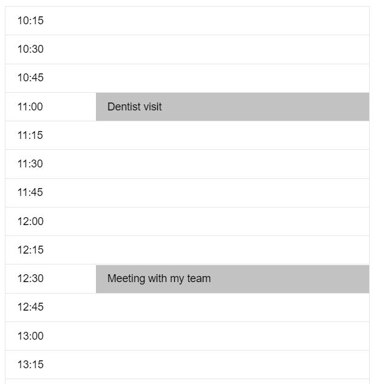

# Toxic Schedule component

Angular 6 module, rendering time slots for appointments.



## Usage

```
<toxic-schedule 
    [interval]="15" 
    [startTime]="startTime" 
    [endTime]="endTime" 
    [timeSlots]="timeSlots"
    (slotSelected)="getSelectedTime($event)">
</toxic-schedule>
```

- **interval** - number, slot intervals in minutes
- **startTime** - Date object, representing the schedule start time
- **endTime** - Date object, representing the schedule end time
- **timeSlots** - list of predefined time slots, which should be displayed in the schedule
- **slotSelected** - event, which will be emittted when a slot is selected. TimeSlot model 
will be passed, eigther empty or one of the preselected.

## TimeSlot model

```
const timeSlot = new TimeSlot(dateTime, [description]);
```

- **dateTime** - value for time slot start date/time. Date, string or milliseconds.
- **description** - optional, plain text description for this time slot. 
